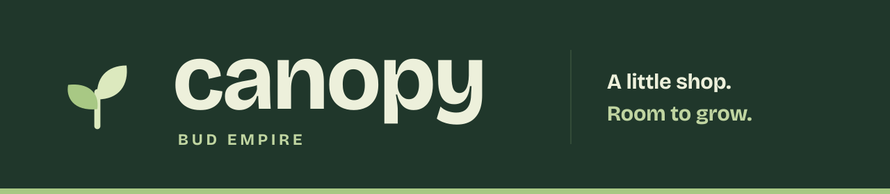
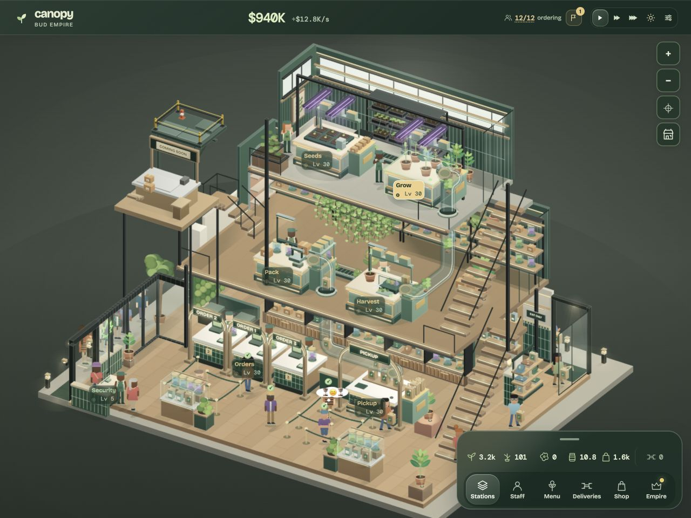
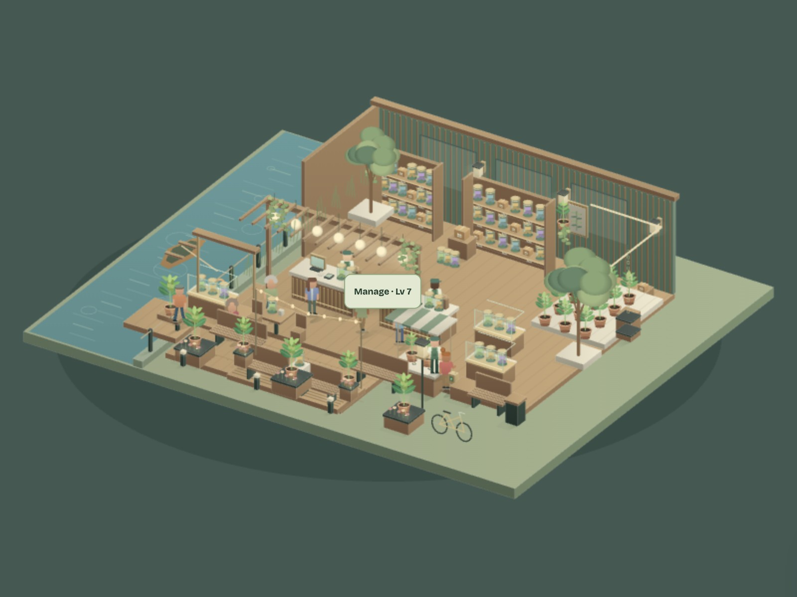
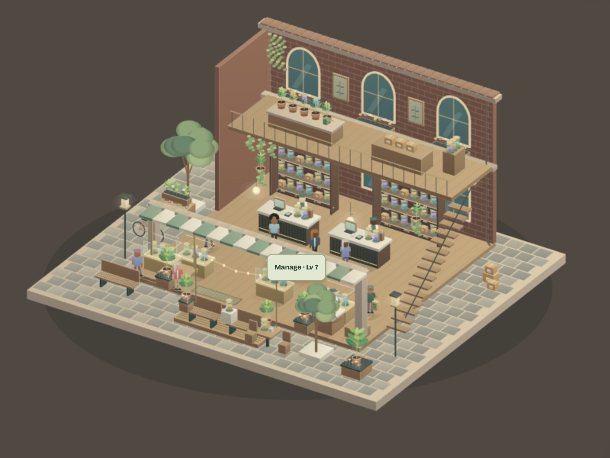
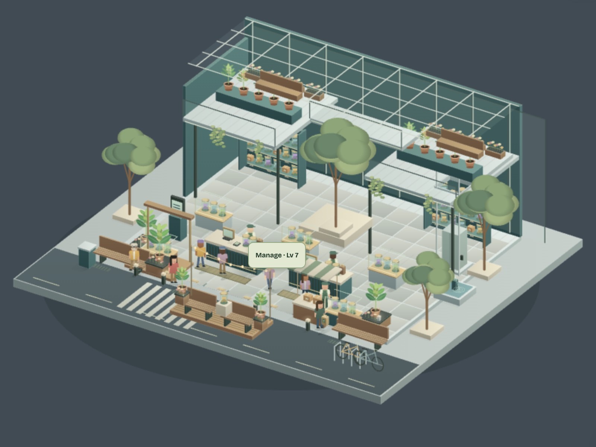
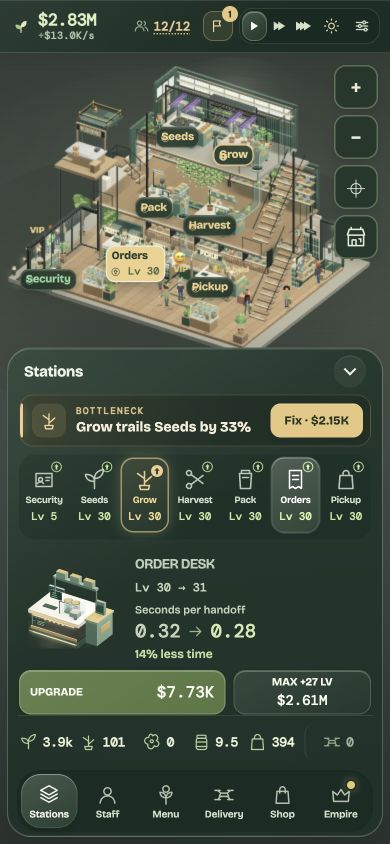

<p align="center">
  
</p>

<p align="center">
  <strong>Grow the goods. Welcome the neighborhood. Build your empire.</strong><br>
  A mobile-first idle game inside a living, isometric dispensary.
</p>

<p align="center">
  <a href="https://shift-idle-factory.loumeau-kevin.chatgpt.site"><strong>Play the hosted build</strong></a>
  &nbsp;·&nbsp; <a href="#run-locally">Run locally</a>
  &nbsp;·&nbsp; <a href="#a-neighborhood-of-your-own">Explore the stores</a>
  &nbsp;·&nbsp; <a href="docs/GUIDE.md">Game & developer guide</a>
</p>

<p align="center">
  <sub>Plain JavaScript &nbsp; / &nbsp; Canvas 2D &nbsp; / &nbsp; Vite &nbsp; / &nbsp; Browser saves</sub>
</p>



<p align="center"><sub>Actual gameplay from a local showcase save. The hosted build may be behind this checkout.</sub></p>

## From the first seed to the next storefront

Start with one shop and a simple loop. Grow and harvest, pack the shelves, take orders, and send customers home with their bags. Reinvest in the slowest station and watch the building, team and neighborhood grow with you.

**Seeds → Grow → Harvest → Pack → Orders → Pickup**

- **A shop you can watch.** Animated staff, growing plants, winding customer queues, warm lighting and a multi-floor architectural cutaway. Pan, zoom and switch between day and night.
- **Upgrades you can see.** Equipment changes as it levels up. One ordering spot expands into two, then three individually staffed counters, each with its own till and customer position.
- **A menu with personality.** Cultivate four strains, choose what to feature, and develop flower, pre-roll and edible product lines. Trends, potency and customer tastes shape the business.
- **More than the next purchase.** Follow seven story chapters, meet regulars, dispatch drones, take on timed events and manage a growing network of stores.

## A neighborhood of your own

Each branch has its own architecture, projects, people and operations. They share your cash while keeping their own management and progression.

<table>
  <tr>
    <td width="33%"><a href="docs/assets/riverside.jpg"></a></td>
    <td width="33%"><a href="docs/assets/old-town.jpg"></a></td>
    <td width="33%"><a href="docs/assets/city-center.jpg"></a></td>
  </tr>
  <tr>
    <td valign="top"><strong>Riverside</strong><br><sub>Cedar, river light and a neighborhood pace. Cultivation and supply operations.</sub></td>
    <td valign="top"><strong>Old Town</strong><br><sub>Brick, brass and botanical displays. A boutique home for specialty products.</sub></td>
    <td valign="top"><strong>City Center</strong><br><sub>Glass, rooftop greenery and a busy plaza. Flagship growth and city deliveries.</sub></td>
  </tr>
</table>

## Your shop, within reach

Tap a station to see what the next level changes. Keep the map in view, open the controls you need, and collapse the tray when you want to watch the shop work.

| Tab | Make your next move |
| --- | --- |
| **Stations** | Compare upgrades and improve the production chain. |
| **Staff** | Train the team, from door security to pickup. |
| **Menu** | Feature strains and develop new product formats. |
| **Deliveries** | Dispatch web orders and manage drone automation. |
| **Shop** | Add equipment, storage, kiosks and customer comforts. |
| **Empire** | Grow branches, meet regulars and collect rewards. |

**Touch:** drag to pan, pinch to zoom, tap to manage.<br>
**Desktop:** drag and scroll; <kbd>Space</kbd> pauses, <kbd>1</kbd> <kbd>2</kbd> <kbd>4</kbd> set speed, and <kbd>Esc</kbd> closes overlays. Focused controls retain their normal keyboard behavior.

<details>
<summary><strong>See the phone interface</strong></summary>
<p align="center"></p>
</details>

## Run locally

Use **Node.js 22.12+**; the pinned Vite version also supports Node 20.19+.

```sh
git clone https://github.com/kevinloumeau/Canopy---Bud-Empire.git
cd Canopy---Bud-Empire
npm ci
npm run dev -- --host 127.0.0.1 --port 4180
```

Open **[127.0.0.1:4180](http://127.0.0.1:4180/)** and start growing. No account or game server is required.

<details>
<summary><strong>Production build and preview</strong></summary>

```sh
npm run build
npm run preview -- --host 127.0.0.1 --port 4181
```

Open [127.0.0.1:4181](http://127.0.0.1:4181/). Output lives in `dist/`. The scripts default to port 4173 without an override; previewing does not publish anything.

The build targets Safari 14 and converts Vite's entry to a deferred classic script through [`scripts/make-classic.mjs`](scripts/make-classic.mjs). Asset paths are relative, including when served under a subdirectory.

</details>

## Built to keep the shop alive

The world is drawn with **Canvas 2D**. Plain JavaScript runs production, customer routing, the economy and branch operations; HTML controls keep management separate from the scene. **Vite** handles local development and production builds.

Progress saves automatically in your browser. Older saves migrate forward, and a welcome-back report summarizes up to four hours of estimated earnings at normal speed. Pause also stops offline earnings.

<details>
<summary><strong>Saves, installation and offline behavior</strong></summary>

- Progress uses `shift-save`, with `shift-save-backup` as a fallback. The guide uses `shift-guide-seen`.
- Saves belong to a browser and origin. `localhost`, `127.0.0.1`, different ports and the hosted game have separate progress; cloning the repo does not transfer a save.
- The web manifest, home-screen icons and production service worker support installation and an offline page fallback. The service worker is disabled on local development origins.
- Offline earnings are estimates. The game does not invent completed deliveries or customer visits while you are away.
- Daily rewards and event deadlines follow the device clock. These are local systems, not server-validated accounts.

</details>

<details>
<summary><strong>Progression, counters and deliveries</strong></summary>

- **Counter expansion:** $2,500 opens counter two; $12,500 opens counter three. Each includes an employee. A shared queue assigns free desks, and every customer orders before pickup.
- **Equipment tiers:** levels 10, 20, 30, 50, 75 and 100 double station output. Orders and Pickup gain service efficiency every five levels, separately from physical counter expansion.
- **Kiosks:** install the hardware before purchasing software upgrades. Staffed counters and kiosks share stock reservations.
- **Drone deliveries:** the $7,500 pad includes the base auto drone. A $25,000 bulk upgrade dispatches up to ten available orders per launch, subject to demand and stock.
- **Branch life:** independent upgrades, optional projects, stock, products, staff assignments, regular-customer requests and cosmetic choices.
- **Long-term goals:** story chapters, career milestones, a seven-day reward track, rotating shift goals, hourly events and prestige. Reopening begins at $10 million lifetime revenue, with the requirement tripling per rank.

See the [full guide](docs/GUIDE.md) for mechanics, controls and compatibility details.

</details>

## Under the canopy

```sh
npm test
npm run build
```

The unit suite covers economy, migration, progression, branches, strains, deliveries, story chapters and shared counter reservations. Browser checks exercise the game at desktop and phone sizes with isolated saves.

**Latest recorded checks · September 19, 2026:** 64 unit tests and the classic production build passed. Desktop and phone checks covered station layouts, purchases, kiosk prerequisites, counter expansion and save persistence. Actual iPhone/Safari hardware has not been tested in this pass. [Validation history →](PROJECT_CONTEXT.md)

<details>
<summary><strong>Code map and browser checks</strong></summary>

| Start here | Responsibility |
| --- | --- |
| [`src/main.js`](src/main.js) | Main shop, Canvas renderer, customers, input and saves |
| [`src/economy.js`](src/economy.js) | Throughput, tiers, baskets and reward calculations |
| [`src/order-counters.js`](src/order-counters.js) | Staffed expansion, queue assignment and reservations |
| [`src/journey.js`](src/journey.js) | Story chapters and saved completion |
| [`src/progression.js`](src/progression.js) | Branches, career, rewards, goals and events |
| [`src/operations.js`](src/operations.js) | Stock, staff, transfers, regulars and customization |
| [`src/branch-maps.js`](src/branch-maps.js) | The three neighborhood scenes |
| [`src/strains.js`](src/strains.js) · [`src/depth.js`](src/depth.js) | Strains, product formats and prestige |
| [`src/deliveries.js`](src/deliveries.js) · [`src/auto-drone.js`](src/auto-drone.js) | Web demand and automated dispatch |
| [`tests/`](tests/) | Unit tests and browser regression helpers |

The recent browser helpers are [`experience-check.js`](tests/experience-check.js), [`order-counters-check.js`](tests/order-counters-check.js) and [`kiosk-software-check.js`](tests/kiosk-software-check.js). They are browser modules served through Vite and require their documented fixtures. They are not Node CLI scripts.

Older `tests/*-check.cjs` helpers use Playwright and installed Chrome; Playwright is not a package dependency. Set `PLAYWRIGHT_MODULE` and `GAME_URL` as needed, and review older selectors against the current interface. See the [developer guide](docs/GUIDE.md#testing).

</details>

<details>
<summary><strong>Working on the game</strong></summary>

Read [PROJECT_CONTEXT.md](PROJECT_CONTEXT.md), [AGENTS.md](AGENTS.md) and [DESIGN.md](DESIGN.md) before making changes. Preserve the Canvas renderer, classic Safari build, fixed orientation, pan/zoom and existing saves. Exercise affected interactions at desktop and phone sizes.

The project began as SHIFT, then GROVE, before becoming Canopy. Its package name, save key and existing hosting identity remain for continuity. Local changes do not automatically publish. Keep the existing Site configuration in [`.openai/hosting.json`](.openai/hosting.json).

</details>

---

<p align="center">
  <br>
  <strong>Plant the first seed. See what grows.</strong><br>
  <sub><a href="https://shift-idle-factory.loumeau-kevin.chatgpt.site">Play</a> · <a href="#run-locally">Build</a> · <a href="docs/GUIDE.md">Explore the guide</a></sub>
</p>
